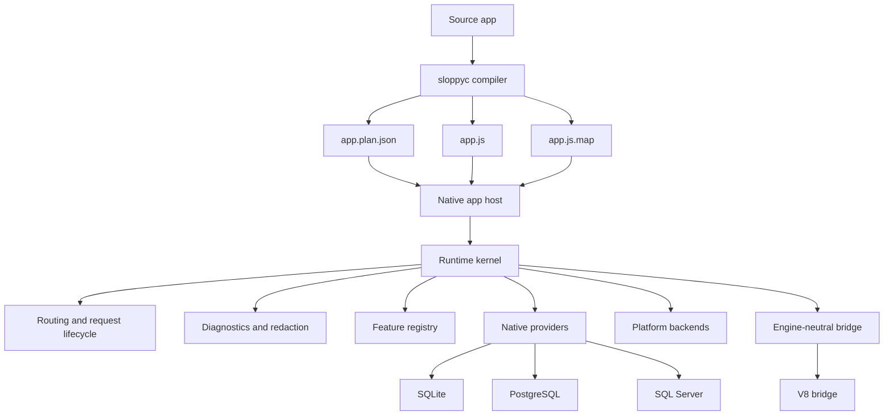
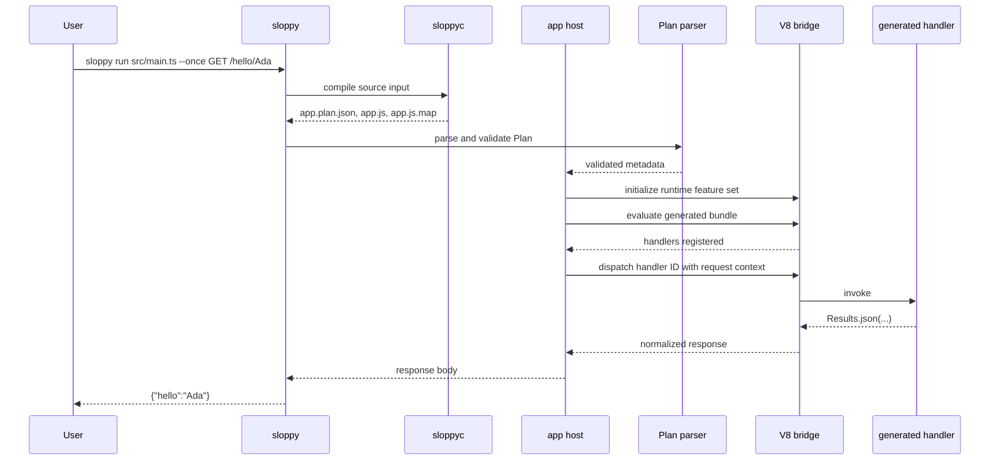
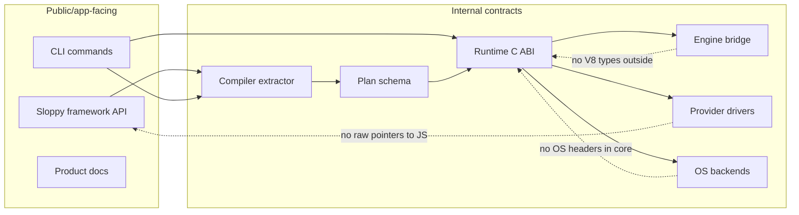

# Architecture

## Purpose

Sloppy is a pre-alpha runtime project with explicit ownership boundaries:

- Rust compiler (`sloppyc`) owns source parsing and artifact generation.
- C app-host/runtime owns plan validation, lifecycle, and native contracts.
- C++ V8 bridge owns JS execution behind Sloppy-owned ABI types.

This document records current architecture reasoning and boundaries for
maintainers.

## Where It Lives

- `compiler/` owns source parsing, source-shape validation, artifact generation,
  and compiler fixture tests.
- `src/core/` owns Plan parsing, app-host validation, diagnostics, routing, HTTP
  dispatch, and native lifecycle code.
- `src/engine/v8/` owns all V8-specific types, contexts, handles, and exception
  mapping.
- `src/data/` owns provider-neutral and provider-specific native database work.
- `src/platform/` owns OS-specific implementation details and transport
  backends.

## Main Concepts

Sloppy is artifact-first. The compiler extracts a static app shape and emits a
Plan plus generated JavaScript. The native runtime validates the Plan before
loading handlers, then dispatches through an engine bridge. Provider, platform,
HTTP, memory, and diagnostics boundaries are runtime-owned contracts rather than
ambient framework behavior.

## Lifecycle

The normal path is: source input, compiler extraction, artifact emission, Plan
parse, app-host validation, feature activation, engine initialization, handler
registration, request dispatch, request cleanup, and app shutdown. Each step can
fail before the next step begins; a later step should not reinterpret earlier
metadata.

## Invariants

- Core modules do not include OS headers or call OS APIs directly.
- V8 types do not escape `src/engine/v8/*`.
- JavaScript code never receives raw native pointers.
- Plan validation is fail-closed and deterministic.
- Optional lanes stay separate from default non-V8 validation.

## Failure Behavior

Architecture boundary failures should stop at the closest owning layer. Compiler
source-shape failures become compiler diagnostics. Plan shape failures stop app
startup. Engine failures map to Sloppy diagnostics before crossing the C ABI.
Provider and platform failures must preserve ownership and redaction rules.

## Public API Relationship

Public docs describe `sloppy`, `sloppyc`, framework APIs, artifacts, providers,
and runtime behavior. This internals page explains why those surfaces are split
across compiler, runtime, engine, provider, and platform ownership.

## Tests And Evidence

Architecture coverage comes from compiler fixtures, Plan parser goldens,
app-host startup tests, platform boundary scanners, C standards checks, V8 smoke
tests, provider conformance tests, and docs freshness checks. Default non-V8
checks cover the default lane.

## Maintainer Review Checklist

- Does the change keep source extraction in `compiler/` and runtime execution in
  `src/core`/engine boundaries?
- Does any new native dependency have a documented owner and evidence lane?
- Does app-facing documentation describe behavior without exposing internal
  engine/provider/platform details as public API?
- Does the changed path have a deterministic failure mode and diagnostic?
- Are optional lanes reported separately from default non-V8 checks?

## Current Limits

Sloppy is still pre-alpha. npm-style dependency resolution, OS sandboxing,
package release hardening, and benchmark-backed performance comparisons are
future scoped work.

## System Layers

```text
source app
  -> sloppyc
  -> Plan + bundle + source map
  -> app host
  -> runtime kernel
  -> engine bridge / providers / platform backends
```



Artifact execution is intentional: startup can validate app metadata before
request dispatch.

## Request Execution Path



## Ownership Map

| Area | Owner | Owns | Must not own |
| --- | --- | --- | --- |
| Source extraction | `compiler/` | Source-shape recognition, diagnostics, artifact emission | Runtime execution, live provider calls, Node package resolution |
| Plan validation | `src/core/plan_parse.c`, `src/core/app_host.c` | Schema, target, route, feature, provider, capability checks | Compiler AST state, V8 handles, OS handles |
| Runtime lifecycle | `src/core/*` | App/request lifetime, cleanup scopes, routing, diagnostics | OS-specific calls outside platform backends |
| Engine bridge | `src/engine/v8/*` | V8 isolates, contexts, JS values, exception mapping | Public C API types, platform transport policy |
| Providers | `src/data/*` | Driver handles, provider values, connection pools, redaction | JavaScript raw pointers, unredacted secrets |
| Platform | `src/platform/*` | OS calls, libuv transport backend, platform-specific helpers | App graph semantics, provider policy |
| Stdlib | `stdlib/sloppy/*` | Framework API, bootstrap helpers, JavaScript descriptors | Native resource ownership, runtime behavior outside documented scope |

## Cross-Cutting Boundaries



The dotted relationships are guardrails: they exist to prevent implementation
details from becoming accidental public API.

## Runtime Kernel

Current core responsibilities visible in source:

- plan parsing and shape validation (`src/core/plan_parse.c`);
- app startup and request lifecycle invariants (`src/core/app_host.c`);
- command routing and mode selection (`src/main.c`);
- provider-neutral and provider-specific native contracts (`src/data/*.c`).

## Engine Boundary

V8 is optional and isolated to `src/engine/v8/*`.

Architecture invariants:

- one owner thread per isolate for mutable runtime entry;
- V8 types and handles do not leak into public runtime headers;
- generated handlers register through bridge-owned callbacks;
- Promise/exception outcomes are translated into Sloppy diagnostics;
- non-V8 lanes cover native/runtime behavior without JS handler execution.

## Platform Boundary

Core runtime modules do not own OS headers or raw OS APIs directly. Platform and
transport details remain implementation layers behind Sloppy-owned interfaces.

## Provider Boundary

Provider architecture is split by layer:

- plan metadata relationships (`dataProviders` and `capabilities`);
- native provider execution in `src/data/*.c`;
- V8 bridge adaptation in provider intrinsics modules.

This keeps pointer ownership and capability checks explicit and auditable.

## Current Limits

Current architecture still leaves these areas for future scoped work:

- third-party JavaScript runtime or package-manager app compatibility;
- production hardening;
- OS sandbox guarantees;
- release publishing workflow hardening;
- benchmark-backed performance comparisons.
