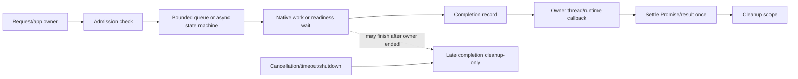

# Concurrency And Async Model

Sloppy concurrency is owner-thread based. Native worker threads and platform callbacks may
complete work, but JavaScript execution enters a V8 isolate only through the owning engine
thread and documented bridge boundaries.

## Purpose

This page records the ownership, cancellation, deadline, and late-completion
rules that keep runtime async work deterministic.

## Where It Lives

- `src/engine/v8/*` owns V8 owner-thread entry and Promise settlement.
- `src/platform/libuv/*` owns libuv-backed transport and readiness callbacks.
- `src/data/*` owns provider executor modes and provider-specific async state.
- `stdlib/sloppy/*` exposes JavaScript worker, time, provider, and framework
  APIs that sit on top of those native boundaries.

## Main Concepts

Async work is scoped by owner, queue, capability, and cleanup lifetime. Native
work can complete later than the request or resource that submitted it, so
ownership transfer, cancellation, timeout, shutdown, and discard paths must be
explicit.

## Lifecycle

A request creates request-owned state, admits native or provider work through the
owning subsystem, posts completion back to the owner thread or runtime callback,
settles caller-visible state once, and then runs cleanup. Shutdown rejects new
work, drains or cancels admitted work according to subsystem policy, and treats
late completions as cleanup-only.

## Async Owner Matrix

| Work type | Owner | Admission boundary | Completion boundary |
| --- | --- | --- | --- |
| V8 handler Promise | V8 owner thread | bounded microtask contract | owner isolate settlement |
| HTTP transport | transport/app host | connection/request limits | request cleanup and response writer |
| SQLite provider work | provider executor | serialized blocking queue | owner-thread Promise settlement |
| PostgreSQL provider work | provider runtime | nonblocking libpq state machine | owner-thread Promise settlement |
| SQL Server provider work | provider runtime | ODBC async mode availability | owner-thread Promise settlement |
| Worker queue/pool | worker resource | bounded queue/backpressure | resource-owned result/cancellation |

## Invariants

- V8 isolate entry is owner-thread only.
- Platform callbacks do not invoke JavaScript directly.
- Completion records own or retain every value they need after submission.
- Failed admission does not transfer ownership.
- Cleanup callbacks run at most once.

## Failure Behavior

Unsupported async features fail with deterministic diagnostics. Queue overflow,
timeout, cancellation, stale handle use, shutdown, and provider unavailability
must not report success after the owning scope ended.

## Public API Relationship

Public APIs such as workers, provider calls, timers, HTTP request handling, and
typed handler injection depend on these internals, but the public surface does
not expose libuv handles, OS handles, V8 isolate details, or native resource
pointers.

## Tests And Evidence

Coverage lives in worker bootstrap tests, V8 smoke tests, HTTP transport tests,
provider conformance tests, source-input fixtures, and stress/torture lanes when
explicitly run. V8 isolate execution and live-provider behavior use their own
lanes.

## Current Limits

The current runtime has a bounded owner-thread microtask drain, not a Node
event loop compatibility layer. Web Worker compatibility, public streaming
APIs, and production hardening are future work.

## Core Rules

- V8 isolate access is owner-thread only.
- Platform callbacks never expose OS or libuv handles outside platform/runtime boundaries.
- Native async completions post back into Sloppy-owned completion paths.
- Cancellation, timeout, shutdown, and late completion are explicit terminal states.
- Cleanup is once-only and tied to request, app, resource, or provider lifetime.
- Optional async/provider/stress evidence lanes are separate from default evidence.

## Request And App Lifetimes

The app owns startup resources until shutdown. A request owns request-scoped arena storage,
cleanup registrations, cancellation/deadline state, and resource references for the
duration of handler dispatch. Request cleanup runs after success, failure, cancellation, or
timeout. Independently closable resources still belong in resource-table entries and must
be closed through registered cleanup when request-scoped.

## V8 Async Boundary

Direct async handlers are supported only when the returned Promise settles during the
bounded V8 owner-thread microtask drain. This is a bounded owner-thread drain rather than
a Node-style timer/fetch/process layer or arbitrary pending-native-async runtime. If a
Promise cannot settle within the scoped owner-thread drain contract, the runtime must fail
clearly rather than report partial/default validation as success.

## Provider Work

Provider work is separated from generic async completion. Provider descriptors, admission,
capability checks, executor mode, bounded queues, cancellation, deadline behavior, and late
completion must remain provider-owned runtime contracts. SQLite-class blocking work may use
serialized/offloaded provider execution where the scoped lane supports it. PostgreSQL
JavaScript provider work uses a provider-owned nonblocking libpq state machine with
Sloppy-owned socket readiness watches and owner-thread Promise settlement. SQL Server
JavaScript provider work uses ODBC asynchronous connection/statement mode and Sloppy-owned
V8 continuations; drivers that cannot enable async behavior must be reported as
unsupported rather than hidden behind a blocking worker.

## HTTP Transport

The HTTP transport lives behind platform/runtime abstractions. It owns bounded connection
and request admission, read/header/body/request/write timeouts, disconnect handling,
shutdown terminal paths, bounded sequential keep-alive, and scoped chunked handling.

Transport callbacks must not enter V8 directly. Dispatch crosses into the engine through
the runtime-owned handler boundary after request parsing, capability checks, and lifecycle
setup. Pipelining, public request/response streaming APIs, HTTP/2, HTTP/3,
WebSockets, production graceful drain, and scalable async HTTP are future scoped
work.

## Time And Deadlines

Time APIs provide Sloppy-owned delay, deadline, cancellation, interval, scheduled job, and
fake-clock semantics where the active runtime bridge is available. Deadline-aware APIs must
observe pre-cancelled and expired inputs before work submission. Native work that has
already been submitted may still complete later; late completion must be cleanup-only and
must not double-settle caller-visible state.

## Evidence Requirements

Concurrency and async PRs should include:

- source docs and invariants under review;
- owner-thread and native-thread boundaries;
- cancellation/deadline/shutdown outcomes;
- late-completion behavior;
- cleanup-once checks;
- negative paths for overflow, timeout, cancellation, invalid lifecycle, and unsupported
  features;
- separate reporting for default, V8, provider, stress/torture, sanitizer, and benchmark
  lanes.

Skipped optional lanes must be reported as not run. Benchmark or stress smoke
is harness coverage, not a production or performance conclusion.
