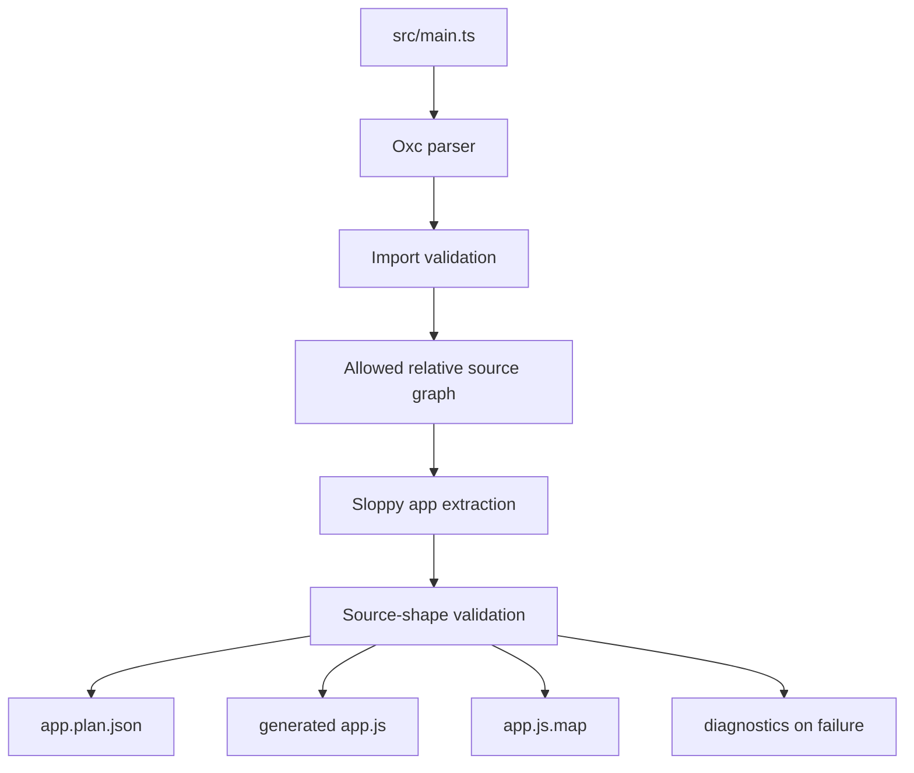

# Compiler

## Purpose

`sloppyc` is Sloppy's Rust compiler/build tool. It parses the supported JavaScript source
subset, validates the current application shape, and emits deterministic artifacts for the
runtime host.

## Where It Lives

- `compiler/src/sloppyc.rs` owns the main extraction and emission path.
- `compiler/src/sloppyc/*` contains focused compiler modules such as schema and
  effects helpers.
- `compiler/tests/fixtures/**` pins source input, generated JavaScript, Plan,
  source map, and diagnostic contracts.
- `docs/reference/supported-syntax.md` is the public syntax lookup.

## Main Concepts

The compiler is a static extractor, not a JavaScript runtime. It recognizes a
narrow Sloppy framework subset, emits deterministic artifacts, and rejects
unsupported dynamic behavior instead of approximating it.

## Lifecycle

`sloppyc build` parses the entrypoint, loads allowed relative modules, extracts
app/framework metadata, validates source-shape constraints, emits `app.plan.json`,
emits generated `app.js`, emits `app.js.map`, and returns deterministic
diagnostics on failure.

## Extraction Boundaries

| Boundary | Accepted today | Rejected today |
| --- | --- | --- |
| Imports | first-party `sloppy` modules and relative source files | unsupported bare specifiers, dynamic import, Node built-ins |
| Routes | literal `get/post/put/patch/delete` shapes | computed route methods, dynamic route patterns |
| Handlers | supported `Results.*` and typed handler subset | arbitrary TypeScript lowering, unsupported captures |
| Providers | metadata for SQLite/PostgreSQL/SQL Server surfaces | dynamic provider names and unsupported executable bridge shapes |
| Artifacts | deterministic Plan, bundle, source map | timestamps, private absolute paths, secret material |

## Invariants

- Output order is stable.
- Paths in goldens and package fixtures are normalized.
- Unsupported syntax fails clearly.
- Generated JavaScript targets Sloppy bootstrap APIs, not Node globals.
- Secrets and local absolute paths are not embedded in artifacts.

## Failure Behavior

Parse, unsupported import, unsupported route shape, dynamic provider name,
unsupported typed binding, unresolved type, and provider bridge gaps become
stable compiler diagnostics. The compiler must not silently drop a route,
handler, provider, schema, or capability to make output look successful.

## Public API Relationship

Public docs expose the supported syntax and CLI shape. Internally, the compiler
also defines the artifact shape consumed by the runtime and the source-map spans
used by diagnostics.

## Tests And Evidence

Evidence comes from `cargo test`, compiler fixture snapshots,
source-input fixture checks, Plan parser tests, generated artifact checks, and
`tools/windows/check-rust-standards.ps1`.

## Current Limits

The compiler does not implement arbitrary TypeScript lowering, decorators,
controllers as a general runtime pattern, npm package resolution, watch mode,
or dynamic imports.

## Current Output

`sloppyc build <source.js|source.ts> --out <dir>` emits deterministic artifacts:

- `app.plan.json`;
- generated `app.js`;
- `app.js.map`.

Artifact hashes use deterministic `sha256:` values. Source-map and artifact paths must be
normalized so tests and package fixtures do not depend on a developer's checkout path.

## Supported Shape

The current compiler supports a narrow source subset:

- recognized first-party imports from `sloppy` modules;
- a static source graph rooted at a project entrypoint such as `src/main.ts`;
- direct app creation and route registration shapes documented in
  `docs/reference/supported-syntax.md`;
- inline route handlers that return supported `Results.*` descriptors;
- selected async handler shapes that settle through the current V8 Promise contract;
- provider metadata for first-party database providers;
- capability, route, result, source-map, completeness, and configuration metadata required
  by the current runtime host.

Unsupported syntax must fail with deterministic diagnostics. `dynamic route strings`,
arbitrary module graphs, decorators, controllers, TypeScript lowering, npm packages, and
Node built-ins are not part of the current compiler contract.

## Runtime Boundary

The compiler emits artifacts; it does not execute app code. Runtime execution is owned by
`sloppy run --artifacts` or source-input `sloppy run <source.js|source.ts>` after compilation. The
compiler does not implement Node package resolution, npm install behavior, or a package
manager.

The compiler-generated JavaScript targets Sloppy's current runtime bridge. It should not
depend on Node, Bun, Deno, or ambient globals outside the documented Sloppy bootstrap
contract. In particular, this compiler does not implement Node package behavior or Node
compatibility.

## Diagnostics

Compiler diagnostics should include stable codes, source spans, clear messages, and hints
that describe the supported contract. Hints must not point users toward unsupported future
features as if they exist.

## Determinism

Compiler tests pin deterministic output. Any output change must update goldens with a
contract explanation. Generated artifacts must not embed private absolute paths, secrets,
timestamps, nondeterministic ordering, or environment-specific values.

## Related Docs

- `docs/reference/supported-syntax.md`
- `docs/reference/plan-format.md`
- `docs/internals/compiler.md`
- `docs/contributor/testing.md`
