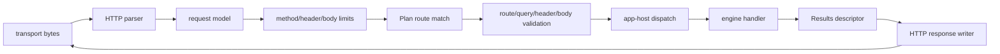

# HTTP Runtime Internals

## Purpose

This page records the native HTTP parsing, route-dispatch, validation, and
transport invariants that support Sloppy request execution.

## Where It Lives

- `include/sloppy/http.h`
- `include/sloppy/http_dispatch.h`
- `src/core/http.c`
- `src/core/http_dispatch.c`
- `src/platform/libuv/http_transport_libuv.c`
- `tests/unit/core/test_http*.c`
- `tests/integration/http_dispatch/**`

## Main Concepts

The current HTTP runtime validates methods, matches routes, performs request
validation, and dispatches handlers through Plan metadata. Transport work is
bounded and scoped to local development/runtime lanes.

## Lifecycle

The transport accepts a connection, parses request bytes, validates method,
headers, body size, and route metadata, materializes request context, dispatches
through the app-host/engine boundary, writes a bounded response, then either
closes or proceeds through the current keep-alive path.

## Failure Map

| Failure | Runtime point | Result |
| --- | --- | --- |
| Malformed request line/header | parser | `400`-class response or transport close according to parser state |
| Unsupported method | dispatch validation | deterministic method diagnostic/response |
| Body too large | body admission | bounded rejection before handler execution |
| Unsupported content type | request validation | validation response before handler execution |
| Route miss | route table lookup | not-found response |
| Handler error | engine/app-host dispatch | mapped runtime diagnostic/response |
| Disconnect/timeout | transport lifecycle | cleanup without double-settlement |

## Invariants

- Route dispatch uses validated Plan metadata.
- Request body and header handling are bounded.
- Transport callbacks do not enter V8 directly.
- Request validation can reject before handler execution.
- Response serialization must not overrun buffers or leak stale request data.

## Failure Behavior

Malformed requests, unsupported methods, body-limit violations, unsupported
content types, route misses, validation failures, timeouts, disconnects, and
engine errors produce deterministic HTTP responses or diagnostics according to
the current dispatch path.

## Public API Relationship

Public user docs expose route handlers, request context, results, and one-shot
or app run commands. Internally, HTTP parsing and transport are implementation
details for the current local development server.

## Tests And Evidence

Coverage comes from core HTTP parser/response tests, HTTP dispatch tests,
transport tests, source-input route fixtures, and V8-gated handler execution
lanes when handlers actually run.

## Current Limits

Production-edge HTTP, public streaming APIs, TLS hardening, and broad middleware
behavior are future scoped work.
