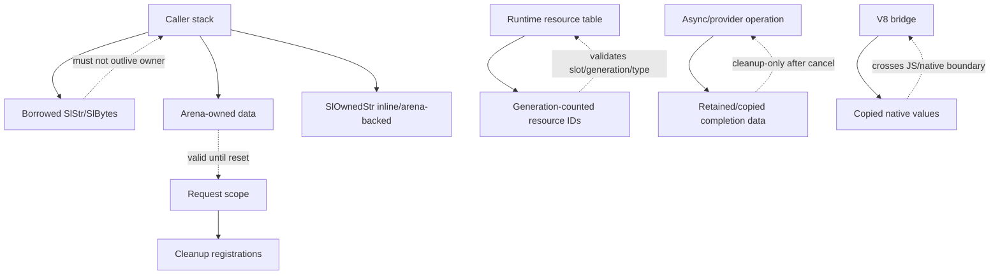

# Memory Model

## Purpose

Sloppy's C runtime treats ownership as part of the API contract. This document defines the
current memory model for borrowed views, arena-owned data, bounded builders, resource
handles, request scopes, async completions, and native/JavaScript boundaries.

## Where It Lives

- `include/sloppy/*.h` declares public and internal memory contracts.
- `src/core/*` implements borrowed views, arenas, builders, resource tables,
  request/app cleanup scopes, and diagnostics storage.
- `src/data/*` copies provider values and result payloads across provider
  lifetime boundaries.
- `src/engine/v8/*` converts V8 values to Sloppy-owned native data before
  crossing engine boundaries.

## Main Concepts

The memory model distinguishes borrowed views, arena-owned data, inline-owned
small strings, operation-owned buffers, resource-table entries, and request/app
cleanup scopes. Ownership must be visible at API boundaries.

## Lifecycle

Data is borrowed, copied to an owner, retained by a scope, or registered in a
resource table before it can outlive the caller. Cleanup happens through the
owning request, app, provider, resource, or async operation exactly once.

## Ownership Table

| Shape | Storage owner | Valid until | Typical use |
| --- | --- | --- | --- |
| `SlStr`, `SlBytes` | caller or referenced owner | documented owner lifetime | borrowed parsing/rendering inputs |
| arena copy | caller-provided arena | arena reset/end | Plan metadata, diagnostics, request-local data |
| `SlOwnedStr` | inline or arena-backed | struct lifetime plus arena lifetime when backed | short owned diagnostic/config strings |
| cleanup scope entry | request/app/resource owner | cleanup callback runs once | native resources and request state |
| resource ID | resource table | generation remains live | JS-visible native handles |
| provider result copy | provider/runtime operation | copied owner lifetime | rows, values, diagnostics |
| V8 conversion copy | V8 bridge/native scope | documented boundary owner | JS strings, buffers, result values |

## Invariants

- Non-empty `SlStr`/`SlBytes` must have valid storage before access.
- Size arithmetic uses checked helpers.
- Arena rollback must not leave outputs pointing into reset ranges.
- JavaScript never receives raw native pointers.
- Late completion owns or retains everything it needs for cleanup.

## Failure Behavior

Allocation, overflow, malformed view, stale resource ID, invalid generation,
and failed admission paths must leave outputs in their documented state and must
not leak ownership. Parser and builder code should rollback or report failure
without silent truncation.

## Public API Relationship

Public headers and generated diagnostics rely on these rules for lifetime,
ownership, and redaction. The JavaScript-facing API sees stable handles and
copied values, not native pointers or borrowed C storage.

## Tests And Evidence

Evidence comes from unit tests for arenas, builders, string/byte primitives,
resource IDs, cleanup scopes, fuzz/property seed replay, sanitizer lanes, and
provider/V8 copy-boundary tests where applicable.

## Current Limits

The allocator story is still intentionally narrow: caller-backed arenas,
standard containers, builders, and resource tables exist, but there is no
general heap-owned buffer abstraction or plugin ABI ownership model yet.

## Core Rules

- `SlStr` and `SlBytes` are borrowed views. They do not imply NUL termination, ownership, or
  stable lifetime beyond the documented owner.
- C-string boundaries are explicit. A component that must pass a Sloppy string to an OS,
  libuv, env, config, or other NUL-terminated API must validate that the borrowed `SlStr`
  contains no embedded NUL before copying it to a terminated arena string.
- Arena-owned strings and bytes remain valid until the arena is reset or its backing storage
  ends.
- Short `SlOwnedStr` results may be stored inline instead of in the arena. Callers should
  read owned strings through `sl_owned_str_as_view` so copied SSO structs resolve to their
  own inline buffer.
- Callers must use checked arithmetic for sizes and offsets that can overflow.
- Public/runtime contracts must state whether returned views are borrowed, arena-owned,
  heap-owned, or operation-owned.
- JS never receives raw native pointers.
- Cross-thread or delayed completion data must be owned, copied, or retained through an
  explicit scope before the caller returns.
- Cleanup callbacks run at most once.

## Implemented Primitives

The current runtime includes:

- `SlStatus` and `SlSourceLoc`;
- borrowed `SlStr` and `SlBytes`;
- arena-owned string and byte copy helpers, including a C-string boundary helper that
  rejects embedded NUL before appending a terminator;
- `SlOwnedStr` inline storage for short owned strings, with longer string copies carrying
  the arena generation that produced their arena-backed storage;
- deterministic string/byte equality, hashing, and canonical byte search helpers with a
  scalar reference path;
- checked `size_t` arithmetic, including array-allocation and three-term-addition helpers;
- assertion macros;
- caller-backed `SlArena` with read-only stats snapshots;
- standard C container primitives for Sloppy-owned memory contracts: `SlSlice`,
  caller-backed fixed vectors, caller/arena-backed ring queues, arena array allocation/copy,
  and arena-backed index hash buckets;
- bounded fixed, small-inline, or arena-backed byte and string builders with deterministic
  internal growth/copy counters;
- app/static-lifetime intern tables for stable metadata;
- fixed-capacity cleanup scopes;
- generation-counted resource IDs and resource tables;
- app and request lifecycle cleanup scopes;
- async completion records with explicit scope retention and discard paths.

## Arenas

Arenas are caller-backed. The owner provides storage and decides the lifetime. Functions
that write into an arena must leave outputs unchanged on failure unless their contract says
otherwise, and should use marks/rollback when parsing or validation can fail after partial
allocation.

Aggregate result APIs that publish arena-backed rows, columns, or values must be
deterministic on failure: either keep the documented unchanged-output contract or clear the
aggregate before returning. If an arena mark is rolled back, no output field may continue to
point into the reset range.

Request-scoped arenas are for one request. App/static arenas are for validated metadata and
startup-owned resources. Scratch arenas must not leak views to longer-lived owners.

Arena-backed `SlOwnedStr` results record the arena generation that produced them for tests
and diagnostics, but callers must still enforce arena lifetime from the owning scope; a
borrowed `SlStr` view cannot validate generation freshness by itself.

Public rendering boundaries must treat non-empty `SlStr`/`SlBytes` views with `NULL`
storage as malformed input and fail or fall back deterministically instead of dereferencing
the view.

`sl_arena_stats` reports capacity, used bytes, remaining bytes, high-water bytes, and the
current generation without mutating the arena. It is internal measurement data for tests,
benchmarks, and future optimization decisions; it is not an allocator abstraction.

## Standard Containers

The C kernel should use Sloppy-owned container primitives instead of repeating pointer,
count, capacity, and bucket arithmetic at every call site. Containers remain compatible
with the arena model:

- fixed vectors and ring queues can use caller-owned storage or storage allocated from an
  arena;
- arena array allocation/copy centralizes checked multiplication, alignment, zero-count
  behavior, and zero-initialized output storage;
- the arena hash index owns only bucket and next-index arrays, while domain tables keep
  their typed entry arrays, generation counters, and ownership contracts;
- public API structs may still expose typed slices where that is the clearest contract, but
  construction and validation should go through the standard primitives.

These containers do not call `malloc`/`free`, do not own OS resources, and do not make
arena-backed views valid after arena reset. They are allowed to copy trivially copyable C
records byte-for-byte; resource ownership and cleanup semantics remain the responsibility
of the typed owner module.

## Builders

Builders are bounded output primitives. They exist to replace repeated ad hoc fixed-buffer
formatting in diagnostics, Plan/artifact paths, HTTP response serialization, CLI output,
and other hot or failure-sensitive paths.

Overflow is a normal error path. Builder failures must not silently truncate semantic
output unless the contract explicitly defines truncation.

Builder appends are allowed to read from the builder's current storage. Overlapping
self-appends must behave as if the source bytes were captured before the append, so callers
do not need a scratch copy for length-preserving byte/string duplication.

Small builders provide explicit small-string/small-byte optimization for local construction.
Their storage is inline inside the builder object, never grows, and has builder lifetime.
They must not be used for outputs that outlive the builder unless the result is copied or
materialized into the documented owner first. Arena-backed builders remain the right choice
for APIs that return arena-owned views.

Builder stats report length, capacity, max capacity, grow count, copied bytes, appended
bytes, failed reserve count, and storage kind. Counters are deterministic internal
measurement evidence and do not change append, reserve, reset, or failure semantics.

## SIMD Backends

Scalar byte/string primitives are canonical. Optional SIMD backends may accelerate a
canonical primitive only when the scalar contract, tests, and fallback behavior already
exist. A SIMD backend must preserve pointer-plus-length semantics, embedded-zero behavior,
failure-output rules, and deterministic first-match results.

`SLOPPY_ENABLE_SIMD=AUTO` is the default. Supported x86_64/AMD64 architectures enable available
compile-time baseline SIMD automatically; unsupported architectures keep the same public
APIs and use the scalar reference path. `SLOPPY_ENABLE_SIMD=OFF` forces scalar fallback,
and `SLOPPY_ENABLE_SIMD=ON` requires a supported backend or fails configuration.
`SLOPPY_SIMD_LEVEL=AUTO` selects the safe baseline backend and does not select AVX2.
`SLOPPY_SIMD_LEVEL=AVX2` builds an AVX2-targeted binary that must only run on AVX2-capable
CPUs.

The initial backends cover byte find, byte find-any, no-NUL scans, and ASCII
case-insensitive string comparison. SSE2 is the default x86_64/AMD64 baseline; AVX2 is available
through the explicit AVX2-targeted `windows-avx2` preset and equivalent CMake configuration. Both are
covered by the same unit/property/fuzz/benchmark smoke coverage as the scalar path.

`sl_str_contains_nul` is a scan predicate, not a complete C-string boundary validator. It
returns false for malformed non-empty NULL-backed views because there is no valid storage to
scan. C-string boundaries must use `sl_str_validate_no_nul` or
`sl_str_copy_to_arena_cstr`, which reject malformed storage before scanning.

## Interned Metadata

Intern tables are for stable app/static metadata such as Plan symbols, route names,
provider tokens, capability metadata, and other validated identifiers. They are not for
secrets, request bodies, transient diagnostics, or user data that should be short-lived.

## Resource Handles

Native resources exposed across runtime boundaries use generation-counted IDs rather than
raw pointers. A resource lookup must validate the table, ID, generation, expected type, and
liveness before use. Stale handles fail deterministically.

## Async Ownership

Queued completions must own or retain all data needed after the caller returns. A successful
post transfers the documented operation ownership to the async loop. Failed admission does
not transfer ownership; the caller remains responsible for cleanup.

Late completions after cancellation, timeout, shutdown, or discard are cleanup-only work.
They must not re-enter user code or report success after the owner scope has ended.

## Engine And Provider Boundaries

V8 strings and values are converted inside the bridge. Native strings/results copied out of
V8 become Sloppy-owned C views before returning through the ABI. SQLite text/blob
parameters and results use explicit copy helpers so synchronous calls and future offload
paths share the same ownership rule.

Provider executor submissions copy textual metadata and operation input bytes before work
can outlive the caller stack. Borrowed cancellation/deadline/scope references must remain
valid through the operation or be explicitly retained.

## Deferred Work

Deferred memory work includes broader hot-path adoption, more allocation-aware regression
tests, provider executor/offload adoption for all provider paths, and any future heap-owned
buffer abstraction that earns its place through a real ownership need.

Historical audits and adoption maps are not current documentation; use GitHub issues for live state.
