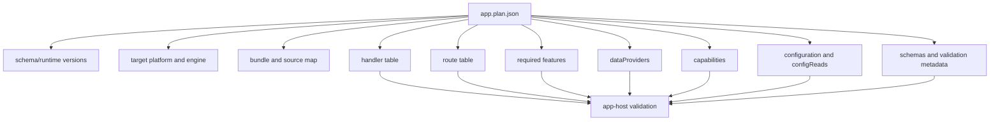

# Plan Internals

## Purpose

The Plan is the validated runtime contract between `sloppyc` and the native app
host. It lets the runtime reject malformed or unsupported application metadata
before request dispatch.

## Where It Lives

- `include/sloppy/plan.h`
- `src/core/plan_parse.c`
- `src/core/app_host.c`
- `tests/golden/plan/**`
- `tests/cmake/check_source_input_run.cmake`
- `docs/reference/plan-format.md`

## Main Concepts

Plan v1 records compiler/runtime versions, target metadata, bundle/source-map
artifacts, handlers, routes, features, providers, capabilities, schemas,
configuration reads, and diagnostics-oriented source metadata. The Plan is data,
not executable JavaScript.

## Lifecycle

The compiler emits `app.plan.json`. The runtime reads it from the artifact
directory, parses it into arena-owned structures, validates required fields and
cross-references, checks target/runtime compatibility, then passes the validated
shape to app-host startup.

## Invariants

- Route metadata and handler IDs must be deterministic.
- Source map links must match emitted artifacts.
- Feature and provider requirements must be explicit metadata.
- Known fields with invalid types fail.
- Duplicate handler IDs, duplicate route method/pattern pairs, and duplicate
  route names fail.
- Secret-bearing provider/capability metadata is rejected.

## Failure Behavior

Malformed JSON, unsupported schema version, invalid target, missing bundle,
invalid hash, duplicate route/provider/capability identity, missing handler
reference, and secret-looking metadata fail before engine initialization.
Parser failure rolls back arena state instead of exposing partial structures.

## Validation Layers

| Layer | Example checks | Owner |
| --- | --- | --- |
| JSON shape | required fields, object/array/string/number types | `src/core/plan_parse.c` |
| Semantic identity | duplicate route names, handler IDs, provider tokens | `src/core/plan_parse.c` |
| Target/runtime | runtime minimum, platform, engine | `src/core/app_host.c` |
| Artifact relationship | bundle/source map path and hash metadata | app-host and CLI artifact loading |
| Feature activation | `requiredFeatures[]` availability | feature registry/app host |
| Provider/capability | provider tokens, capability references, secret-bearing metadata | Plan parser/app host/provider runtime |

## Public API Relationship

Public CLI commands such as `routes`, `capabilities`, `doctor`, `audit`, and
`openapi` read Plan metadata. The Plan reference documents lookup fields; this
internals page documents parser and app-host invariants.

## Tests And Evidence

Evidence comes from `tests/golden/plan/**`, source-input fixture checks,
app-host validation tests, compiler fixture goldens, and package artifact
fixture checks.

## Current Limits

The Plan is not a package manifest, npm metadata format, public extension
system, dynamic plugin format, or OS sandbox declaration.
