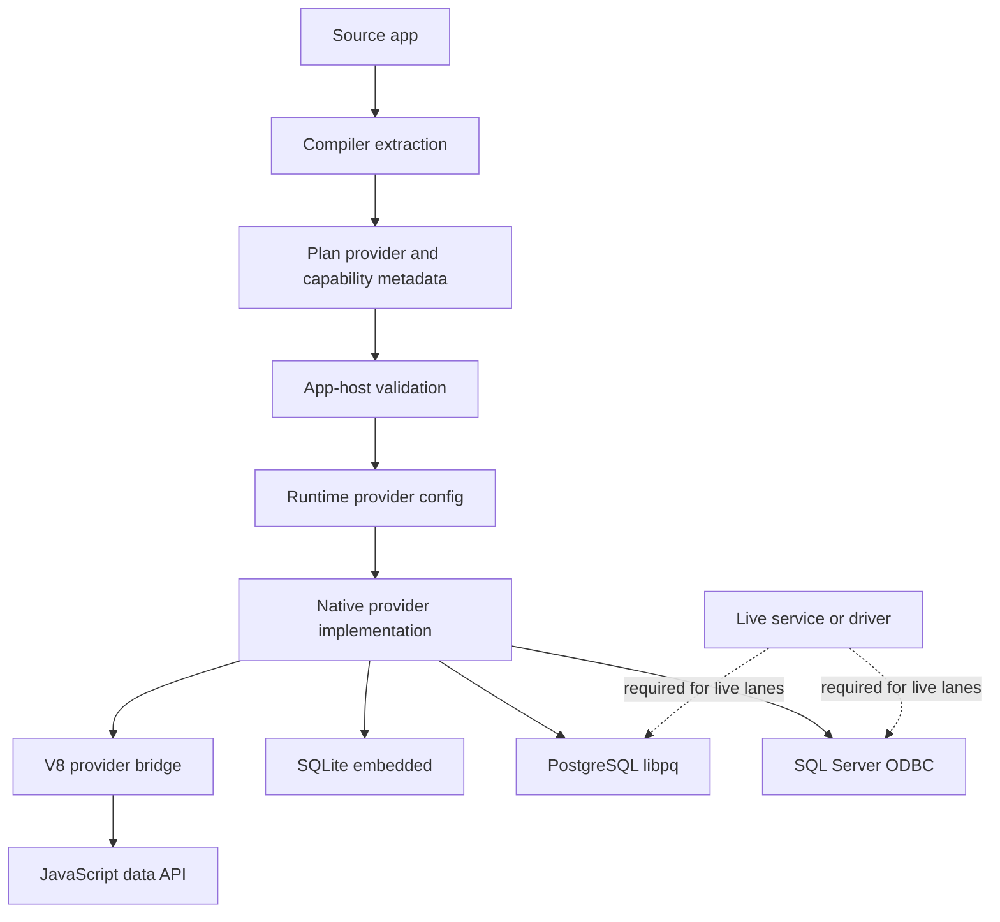
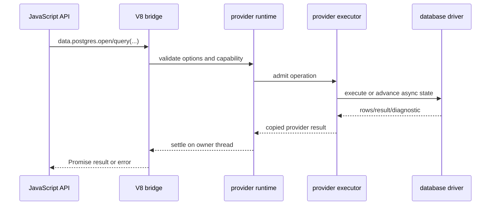

# Data Providers

## Purpose

Data providers connect Sloppy's Plan-visible capability model to native
database/provider boundaries. Provider behavior must be explicit,
capability-checked, and clear about which lanes are executable.

## Where It Lives

- `include/sloppy/data.h` defines the provider-neutral native Db contract.
- `src/data/common.c` implements shared value, statement, result, and redaction
  helpers.
- `src/data/sqlite.c`, `src/data/postgres.c`, and `src/data/sqlserver.c` own
  provider-specific native behavior.
- `src/engine/v8/intrinsics_*` adapts native providers to JavaScript bridge
  APIs.
- `stdlib/sloppy/data.js` and `stdlib/sloppy/providers/sqlite.js` expose
  JavaScript provider APIs.

## Main Concepts

Provider support is split into metadata, native execution, V8 bridge adaptation,
runtime configuration, and live service availability. Each surface has its own
runtime path and validation lane.

## Lifecycle

The compiler or app builder contributes provider/capability metadata. The
runtime validates metadata at startup. A provider call validates feature
activation, configuration, capability, access mode, operation shape, and
resource ownership before admission. Completion copies results to the owner
thread or returns deterministic diagnostics.

## Surface Matrix

| Surface | Current meaning | Validation owner |
| --- | --- | --- |
| `app.use(sqlite(...))` | Framework descriptor registration; current descriptor admission is SQLite-only | stdlib/bootstrap tests and compiler fixtures |
| `app.provider("sqlite:main")` | Static provider handle path that compiles to the current generated bridge | compiler fixtures and SQLite examples |
| `Sqlite<"...">` | Typed Framework v2 provider injection using SQLite provider tokens | compiler typed-handler fixtures and SQLite example |
| `Postgres<"...">` | Typed provider injection that opens configured PostgreSQL bridge options at runtime | compiler fixtures plus V8/live lanes when executed |
| `SqlServer<"...">` | Typed provider injection that opens configured SQL Server bridge options at runtime | compiler fixtures plus V8/live lanes when driver supports async mode |
| `data.sqlite` | Runtime data API for SQLite | stdlib tests, native SQLite tests, V8 bridge tests |
| `data.postgres` | Runtime data API for PostgreSQL | stdlib tests, native/live PostgreSQL tests, V8 bridge live tests |
| `data.sqlserver` | Runtime data API for SQL Server | stdlib tests, native/live SQL Server tests, V8 bridge live tests |

## Invariants

- Provider tokens and capabilities must cross-reference correctly.
- Connection strings and secrets are redacted.
- SQL text and parameters stay separate.
- JavaScript sees Sloppy-owned resource handles or bridge objects, never raw
  driver pointers.
- Missing live dependencies are reported as unavailable or skipped in their own lanes.

## Failure Behavior

Malformed options, missing config, invalid access mode, denied capability,
unsupported value types, stale handles, closed connections, unavailable runtime
features, missing drivers, and async-driver gaps fail closed with provider
diagnostics. PostgreSQL and SQL Server live failures must preserve secret
redaction.

## Public API Relationship

Public provider docs separate descriptor registration, static provider handles,
typed injection, runtime data APIs, native/live lanes, and V8 bridge lanes.
Internally, this page records why those surfaces are documented separately.

## Tests And Evidence

Coverage comes from native provider tests, compiler provider fixtures,
bootstrap tests, V8 smoke tests, provider conformance tests, Docker/live-provider
scripts, and redaction tests. Default, V8-gated, live-provider, stress, and
benchmark lanes remain separate.

## Maintainer Checklist

- Does the doc or code say which provider surface is being changed?
- Does the validation lane match that surface?
- Are connection strings and driver errors redacted?
- Is SQLite embedded behavior kept separate from PostgreSQL/SQL Server live
  service behavior?
- Does SQL Server async-driver unavailability fail closed instead of using a
  hidden blocking fallback?

## Current Limits

SQLite has the most complete local embedded path. PostgreSQL and SQL Server
runtime APIs exist with live/provider and V8 gating, and SQL Server async
behavior depends on driver support. Migrations, ORM behavior, schema tooling,
and production hardening remain outside this internals contract.

## Current Status

Implemented foundations include:

- provider metadata in compiler and Plan artifacts;
- capability metadata and runtime capability checks;
- native provider boundaries for SQLite, PostgreSQL, and SQL Server foundations;
- provider executor infrastructure and completion ownership rules;
- canonical provider execution modes: `SERIALIZED_BLOCKING`, `BLOCKING_POOL`,
  `TRUE_ASYNC`, and fail-closed `UNAVAILABLE`;
- provider-neutral C Db contract types for `DbValue`, SQL statements, parameters,
  columns, row sets, execute results, transaction options, and redacted statement
  diagnostics;
- SQLite provider configuration that maps to `SERIALIZED_BLOCKING` executor policy with
  one active operation per provider instance;
- native SQLite open/close, file and in-memory database, query/exec,
  transaction, binding, result-copy, and diagnostic behavior;
- a V8-gated SQLite bridge that routes SQLite exec/query/queryOne/transaction work through
  the serialized provider executor and settles Promises on the V8 owner thread;
- a V8-gated PostgreSQL bridge that uses libpq's nonblocking state machine, Sloppy-owned
  socket-readiness watches, bounded connection pooling, parameterized exec/query/queryOne,
  callback transactions, and owner-thread Promise settlement;
- a V8-gated SQL Server bridge that enables asynchronous ODBC connection/statement mode,
  advances the driver through Sloppy-owned V8 continuations, owns result payloads before
  Promise settlement, and exposes bounded connection pooling and callback transactions;
- doctor/audit metadata for providers and capabilities;
- tests and examples that distinguish metadata, native provider behavior, V8 bridge
  behavior, and live-provider coverage.
- a provider conformance matrix covering common Db behavior, SQLite default evidence,
  PostgreSQL/SQL Server live-provider lanes, V8 bridge behavior, and stress/torture lane
  reporting without folding those lanes into default results.

The SQLite bridge is async at the JavaScript boundary through the `SERIALIZED_BLOCKING`
executor. SQLite work still runs on one serialized blocking worker per provider instance;
it is not labeled `TRUE_ASYNC`. PostgreSQL JavaScript provider work is labeled
`TRUE_ASYNC` only for the V8 bridge path that is driven by nonblocking libpq and
`SlAsyncIoWatch`, not for blocking-pool fallback. SQL Server JavaScript provider work is
`TRUE_ASYNC` only for the V8 bridge path that successfully enables ODBC async connection
and statement behavior; unsupported drivers fail closed instead of using a blocking-pool
fallback.

## Capability Rules

Provider work must validate:

- provider kind;
- token/name;
- requested access mode;
- configured capability metadata;
- active runtime feature set;
- operation ownership and cleanup.

Failure must produce stable diagnostics and must not leak secrets or connection strings.

## JavaScript Boundary

JavaScript receives Sloppy-owned descriptors and bridge functions, not raw native pointers.
Resource handles use generation-counted IDs or bridge-owned objects. Result text/blob data
must be copied to the documented owner before it outlives the native provider call.

## Provider Executor

The provider executor owns operation admission, bounded queueing, completion dispatch,
cleanup-once behavior, and explicit scope retention. Failed admission does not transfer
ownership. Late completions after cancellation, timeout, shutdown, or discard are
cleanup-only work.

`SERIALIZED_BLOCKING` and `BLOCKING_POOL` are the only worker-backed modes. `TRUE_ASYNC`
is reserved for provider-owned nonblocking state machines that do not occupy blocking
workers while waiting on database I/O. `UNAVAILABLE` keeps a configured provider instance
fail-closed: capability checks still run before admission, but no work is enqueued.

## Common Db Contract

The shared native Db contract lives in `include/sloppy/data.h` and `src/data/common.c`.
It defines provider-neutral value kinds for null, boolean, integers, float64, decimal,
text, bytes, uuid, date/time/timestamp/instant, json, and arrays. The contract keeps SQL
text and parameters separate, carries provider placeholder style metadata, and provides a
redacted statement formatter that never prints parameter values.

Provider-specific implementations still own driver conversion rules, lifecycle, and live
I/O. The common contract is not an ORM, migration layer, SQL parser, or package-manager
surface.

SQLite stores only SQLite-native null, integer, real, text, and blob values. Sloppy maps
JSON, date, time, timestamp, and instant values through explicit text/blob encodings for
SQLite instead of describing native SQLite value types that do not exist.

## Type Mapping Policy

Provider bridges must not silently stringify semantically rich SQL values as the canonical
result shape. The current canonical mapping is:

| SQL shape | JavaScript/provider value |
| --- | --- |
| NULL | `null` |
| boolean/bit | `boolean` |
| int16/int32/safe integer | JS `number` where the provider exposes a safe JS integer |
| int64/bigint | JS `BigInt` at the V8 boundary; native provider integer slots remain `int64_t` |
| float/real/double | JS/native floating value |
| decimal/numeric/money | explicit decimal typed value/string wrapper, not JS `number` by default |
| text/varchar/nvarchar | string |
| bytes/blob/bytea/varbinary | `Uint8Array` at the V8 boundary; `SlBytes` at native boundaries |
| uuid/uniqueidentifier | explicit UUID typed value/string wrapper |
| provider-native JSON | parsed JS JSON for V8 results; JSON text slot at native boundaries |
| date/time/timestamp | explicit date/time/local-date-time typed value/string wrapper |
| timestamp with offset/time zone | explicit instant/offset-date-time typed value/string wrapper |

SQLite weak typing is explicit: JSON/date/time/timestamp-like values stay text/blob unless
the caller supplied an explicit `sql.*`/`data.values.*` wrapper or column policy that marks
the value as semantic. SQL Server JSON-in-`nvarchar` is treated the same way because SQL
Server does not expose a native JSON storage type.

Parameter binding follows the inverse rule. `undefined` is a diagnostic, `null` is SQL
NULL, unsafe integer numbers require `BigInt`, and arbitrary objects/functions/symbols are
not stringified. JSON objects require the explicit JSON wrapper, and raw JSON text requires
the explicit raw JSON wrapper.

## Validation Lanes

- Default non-V8 tests validate native provider metadata and native provider contracts.
- V8-gated tests validate bridge behavior.
- Live-provider tests validate external service integration.
- Benchmark tests validate only the measured workload they report.

These lanes are separate. A default pass is not live-provider or V8 coverage.

Provider implementation PRs should report the following lane names directly:

- default non-V8: `data.common.contract`, provider native tests, diagnostics, redaction,
  and SQLite embedded conformance;
- V8-gated: `conformance.sqlite.bridge`, provider bridge live tests when configured, and
  owner-thread Promise settlement checks;
- live-network/live-provider: Docker-backed PostgreSQL and SQL Server native/bridge lanes
  through `tools/windows/test-live-providers.ps1` or the matching POSIX scripts;
- stress/torture: optional/manual lifecycle pressure such as queue overflow,
  cancellation/timeout races, pool drain, repeated open/close, and late-completion cleanup;
- benchmark: separate measurement only, not provider correctness or readiness.

Missing Docker, missing ODBC driver support, missing environment configuration, or SQL
Server async-driver unavailability must be reported as `UNAVAILABLE`/`unavailable` or
`SKIPPED`/`skipped`, not as a passed provider lane.

## Deferred Work

Deferred provider work includes richer provider audit policy, migrations/schema tooling,
and production hardening.
