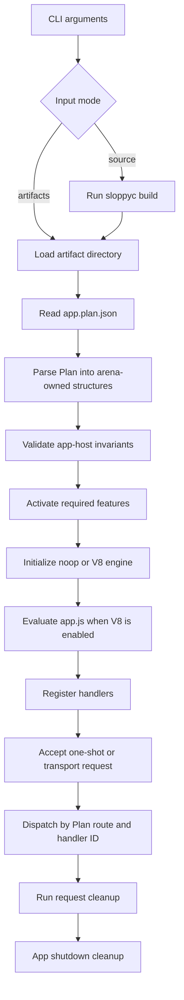

# Runtime Internals

## Purpose

Sloppy executes validated artifacts through a native app-host. It is a
compile-then-run model even when users invoke source-input shortcuts.

## Where It Lives

- `src/main.c` owns CLI mode selection and source/artifact command dispatch.
- `src/core/app_host.c` owns startup validation, app lifecycle, request
  dispatch, and feature activation.
- `src/core/plan_parse.c` owns Plan parsing before app-host validation.
- `src/core/http_dispatch.c` and `src/platform/libuv/http_transport_libuv.c`
  connect route metadata to HTTP execution.

## Main Concepts

The runtime executes artifacts, not arbitrary source trees. Source-input
commands compile first, then run through the same Plan/artifact path. Startup is
fail-closed: no handler dispatch occurs until plan, target, feature, provider,
route, and artifact checks pass.

## Lifecycle

The runtime parses CLI arguments, compiles source input when requested, loads
the artifact directory, parses `app.plan.json`, validates app-host invariants,
initializes the selected engine lane, registers generated handlers, accepts
bounded request work, dispatches through Plan metadata, then cleans up request
and app-owned resources.



## Runtime State Owners

| State | Owner | Lifetime | Failure path |
| --- | --- | --- | --- |
| Parsed CLI options | `src/main.c` | command invocation | command diagnostic and nonzero exit |
| Source-input artifacts | `sloppyc` via CLI wrapper | command/cache directory | compiler diagnostics; runtime never sees partial success |
| Parsed Plan | `src/core/plan_parse.c` arena | app startup | rollback and Plan diagnostic |
| App host | `src/core/app_host.c` | app lifetime | startup diagnostic; no request dispatch |
| Request scope | app host/request dispatch | one request | cleanup after success, error, timeout, or cancellation |
| Engine instance | engine bridge | app lifetime | engine diagnostic and shutdown cleanup |
| Provider handles | provider runtime/resource table | resource/request/app scope | provider diagnostic and resource cleanup |

## Invariants

- Source-input is compile-then-run.
- Artifact execution requires a valid Plan and bundle hash relationship.
- Handler IDs and route metadata must be internally consistent.
- The noop engine validates native runtime paths without JavaScript handler execution.
- Feature activation must satisfy `requiredFeatures` before use.

## Failure Behavior

Bad CLI shape, compiler failure, missing artifact files, Plan parse failure,
target mismatch, unsupported runtime feature, duplicate routes, missing handler
references, and engine initialization failures stop startup or request dispatch
with diagnostics rather than partial success.

## Public API Relationship

The public `sloppy build`, `sloppy run`, `routes`, `capabilities`, `doctor`,
`audit`, and `openapi` commands are thin entrypoints over these internals. User
docs should describe command behavior without exposing app-host structs.

## Tests And Evidence

Coverage comes from CLI tests, Plan goldens, app-host unit tests, source-input
fixtures, HTTP dispatch tests, V8-gated handler execution tests, and package
outside-checkout smoke tests.

## Implementation Notes

Runtime code should treat compiler output as untrusted input. Even source-input
commands go through artifact loading and Plan validation so that `sloppy run
src/main.ts` and `sloppy run --artifacts .sloppy` share the same runtime
contract. CLI convenience must not bypass Plan parsing, feature activation,
target checks, or artifact hash relationships.

## Current Limits

Package-manager app behavior, production-edge HTTP, public streaming, full
platform parity, and benchmark-backed performance comparisons are future scoped
work.

## Current Executable Path

The supported path is:

```text
source app -> sloppyc build -> app.plan.json/app.js/app.js.map -> sloppy run artifacts
```

`src/main.c` exposes `build` and `run` as separate commands and keeps artifact
introspection commands (`routes`, `capabilities`, `doctor`, `audit`, `openapi`)
alongside them.

Source-input run is still compile-first. The default source artifact cache path
is explicit (`.sloppy/cache/dev/source-input` in `src/main.c`).

## Startup Sequence

The runtime model is fail-closed:

1. Parse command mode.
2. Compile if the input mode is source.
3. Parse and validate the plan (`src/core/plan_parse.c`).
4. Validate host startup invariants (`src/core/app_host.c`).
5. Initialize engine lane (noop or V8).
6. Register generated handlers in the engine bridge.
7. Dispatch requests only after metadata/handler validation succeeds.

In current app-host validation, artifacts are constrained to a dev-host contract:
`windows-x64` + `v8` target and runtime minimum compatibility checks are enforced
before serving.

## Engine Modes

Default lanes validate native behavior without V8 execution. V8-enabled lanes
add JavaScript handler execution and bridge behavior. They are reported
separately by design.

Within `src/engine/v8/engine_v8.cc`, dispatch uses registered handler IDs and
owner-thread checks. Promise and exception outcomes are translated into Sloppy
diagnostics.

## Metadata Contracts

Execution is gated by plan correctness, not best effort:

- plan version, required sections, and metadata relationships are validated;
- secret-bearing plan fields are rejected;
- missing handler references or duplicate route/provider/capability identities
  fail startup.

## Non-Goals

Package-manager app behavior, release hardening, and benchmark-backed
performance comparisons are future scoped work.
