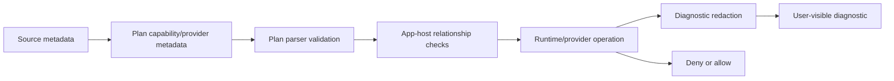

# Security And Permissions

## Purpose

Sloppy is built around explicit authority boundaries. Permission-related behavior
should be visible in metadata, validated at startup, and enforced at runtime
entry points.

This is an auditability model, not OS-level sandboxing.

## Where It Lives

- `src/core/plan_parse.c` validates provider/capability metadata.
- `src/core/app_host.c` validates runtime relationships before serving.
- `src/data/*` owns provider redaction and capability-aware diagnostics.
- `src/engine/v8/*` prevents raw native pointer exposure to JavaScript.
- `docs/explanation/security-and-redaction.md` explains the public model.

## Main Concepts

Authority is explicit metadata. Sloppy prefers validated capabilities, scoped
provider tokens, redacted diagnostics, and startup rejection over ambient access
or best-effort warnings.

## Lifecycle

Security-sensitive metadata is emitted by the compiler or app builder, parsed
from the Plan, validated during app startup, consumed during provider/runtime
operations, and rendered through diagnostics that must preserve redaction.

## Security Boundary Table

| Boundary | Enforced by | Expected failure |
| --- | --- | --- |
| Secret-bearing Plan fields | Plan parser | startup diagnostic |
| Provider/capability mismatch | Plan parser/app host | startup diagnostic |
| Missing runtime feature | feature registry/app host | unavailable feature diagnostic |
| Provider connection secret | provider diagnostics | redacted diagnostic |
| Raw native pointer exposure | V8/resource bridge rules | bridge/API rejection |
| OS sandboxing | documentation and scope checks | tracked as future scoped work |

## Invariants

- Secret-looking fields are rejected from Plan metadata.
- Provider connection strings are not printed in diagnostics.
- Capability/provider relationships must be consistent before execution.
- JavaScript cannot receive native pointers or driver handles.
- Unsupported security-sensitive behavior fails closed.

## Failure Behavior

Malformed capability metadata, missing provider relationships, denied access
mode, secret-bearing Plan fields, unavailable runtime features, and provider
config failures produce diagnostics without leaking sensitive values.

## Public API Relationship

Public docs describe current capability and redaction behavior. This internals
page explains implementation invariants; OS sandboxing and production security
hardening are separate work.

## Tests And Evidence

Coverage comes from Plan validation tests, diagnostics goldens, provider
redaction tests, V8 bridge pointer-boundary tests, config redaction checks, and
docs scanners.

## Current Limits

OS sandboxing, release-grade threat modeling, comprehensive authorization,
cryptographic key management, and production hardening are future scoped work.

## Current Status

From the current source:

- plan parsing validates provider/capability sections and rejects malformed or
  inconsistent metadata (`src/core/plan_parse.c`);
- app-host startup re-validates provider/capability relationships before serving
  (`src/core/app_host.c`);
- provider modules include redaction-aware diagnostic behavior for
  connection-string secrets (`src/data/postgres.c`, `src/data/sqlserver.c`);
- V8 bridge code keeps resource ownership private and avoids raw native pointer
  exposure (`src/engine/v8/*`).

## Capability Model

Capability metadata is treated as a runtime contract. Missing or inconsistent
provider/capability relationships fail validation before normal request
execution.

The design goal is clear denial signals, not implicit ambient access.

## Secret Handling

Plan artifacts are not allowed to carry obvious secret-bearing fields. Provider
diagnostics must redact secret values while keeping failure categories usable.

## Deferred Work

This model still defers OS sandbox enforcement, production hardening, and
broader release-grade security posture work.
