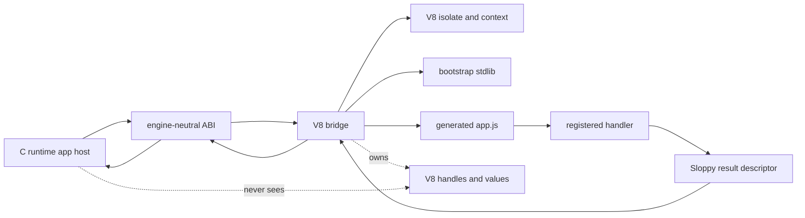
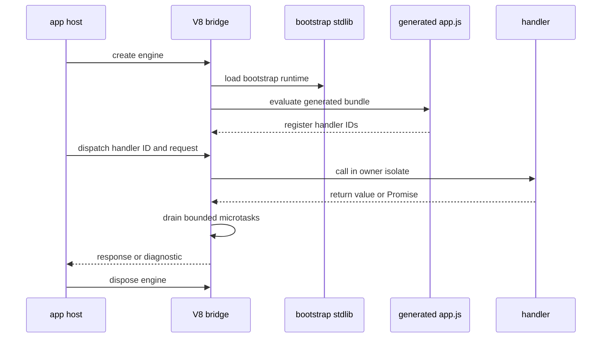

# V8 Bridge Internals

## Purpose

The V8 bridge isolates JavaScript execution from the C runtime kernel. It owns
V8-specific types, contexts, handler registration, exception mapping, Promise
settlement, and intrinsic adaptation.

## Where It Lives

- `src/engine/v8/**`
- `include/sloppy/engine.h`
- `tests/unit/engine/**`
- `tests/conformance/v8/**`
- `stdlib/sloppy/internal/runtime-classic.js`

## Main Concepts

The bridge translates between Sloppy-owned C ABI types and V8 values. It keeps
V8 handles, isolates, contexts, callbacks, and exceptions inside
`src/engine/v8/*` while exposing engine-neutral entrypoints to the runtime.

## Lifecycle

The runtime creates an engine instance, initializes a V8 isolate/context when
V8 is enabled, loads the bootstrap stdlib and generated app artifact, registers
handlers, dispatches requests by handler ID, drains the bounded Promise/microtask
contract, maps results or exceptions back to Sloppy values, and disposes engine
resources during shutdown.

## Invariants

- V8 types are not exposed outside `src/engine/v8/*`.
- Native worker threads must not enter a V8 isolate unless the bridge documents
  ownership.
- JavaScript must not receive raw native pointers.
- C++ exceptions must be mapped to Sloppy diagnostics before crossing ABI
  boundaries.
- Strings and buffers crossing the boundary are copied or owned by a documented
  scope.
- Promise settlement happens on the owning isolate thread.

## Failure Behavior

Non-V8 builds report unavailable engine behavior instead of pretending handlers
ran. V8 initialization, artifact evaluation, handler lookup, thrown exceptions,
Promise rejection, timeout/settlement failure, and intrinsic unavailability map
to Sloppy diagnostics.

## Public API Relationship

Public docs say handler execution is V8-gated. This page explains the internal
boundary without exposing V8 APIs to application code or public C headers.

## Tests And Evidence

Default engine tests cover unavailable-engine behavior in non-V8 builds. V8
smoke and bridge tests are V8-gated.

| Lane | What it validates | Separate lanes |
| --- | --- | --- |
| Default non-V8 engine tests | unavailable-engine diagnostics and ABI shape | JavaScript handler execution |
| V8 smoke tests | handler registration, dispatch, result conversion, exception mapping | package or live-provider behavior |
| Provider bridge V8 tests | provider intrinsic behavior under V8 | native-only provider conformance |
| Source-map exception tests | mapped diagnostics for thrown JS errors | general IDE/debugger integration |

## Current Limits

The bridge runs Sloppy-managed artifacts under V8. Node, Bun, and Deno runtime
compatibility are separate tracks; JavaScript never receives raw native
pointers; default non-V8 checks remain native/runtime coverage.
