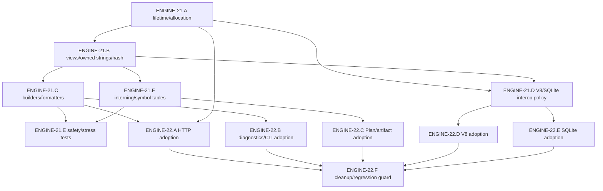

# ENGINE-21/22 Issue Index

Status: GitHub issues created for the memory/string foundation roadmap; ENGINE-21.A/B/C/E/F
are implemented by the primitive foundation slice.

This index records the issue numbers for ENGINE-21 and ENGINE-22 and gives the intended
implementation order. ENGINE-21.D remains the V8/SQLite interop-policy follow-up; ENGINE-22
remains adoption work, not part of the primitive slice.

## EPICs And Tasks

### ENGINE-21: Memory and String Runtime Foundations

EPIC: [#362](https://github.com/RtlZeroMemory/Slop/issues/362)

Tasks:

- [#364](https://github.com/RtlZeroMemory/Slop/issues/364): TASK ENGINE-21.A: Lifetime and Allocation Model.
- [#365](https://github.com/RtlZeroMemory/Slop/issues/365): TASK ENGINE-21.B: String and Byte View Primitives.
- [#366](https://github.com/RtlZeroMemory/Slop/issues/366): TASK ENGINE-21.C: String Builder, Byte Builder, and Formatting Utilities.
- [#367](https://github.com/RtlZeroMemory/Slop/issues/367): TASK ENGINE-21.D: V8 and SQLite String Interop Policies.
- [#368](https://github.com/RtlZeroMemory/Slop/issues/368): TASK ENGINE-21.E: Memory Safety and Stress Tests.
- [#369](https://github.com/RtlZeroMemory/Slop/issues/369): TASK ENGINE-21.F: String Interning and Symbol Table Foundation.

### ENGINE-22: Memory/String Adoption and Hot-Path Refactor

EPIC: [#363](https://github.com/RtlZeroMemory/Slop/issues/363)

Tasks:

- [#370](https://github.com/RtlZeroMemory/Slop/issues/370): TASK ENGINE-22.A: HTTP Memory/String Adoption.
- [#371](https://github.com/RtlZeroMemory/Slop/issues/371): TASK ENGINE-22.B: Diagnostics and CLI Builder Adoption.
- [#372](https://github.com/RtlZeroMemory/Slop/issues/372): TASK ENGINE-22.C: Plan and Artifact Loader Adoption.
- [#373](https://github.com/RtlZeroMemory/Slop/issues/373): TASK ENGINE-22.D: V8 Bridge Adoption.
- [#374](https://github.com/RtlZeroMemory/Slop/issues/374): TASK ENGINE-22.E: SQLite Result/Parameter Adoption.
- [#375](https://github.com/RtlZeroMemory/Slop/issues/375): TASK ENGINE-22.F: Hot-Path Cleanup and Regression Guard.

## Recommended Implementation Order

1. [#367](https://github.com/RtlZeroMemory/Slop/issues/367) ENGINE-21.D locks V8/SQLite conversion policy on top of the implemented primitive layer.
2. [#370](https://github.com/RtlZeroMemory/Slop/issues/370) ENGINE-22.A migrates HTTP parser/request/response paths.
3. [#371](https://github.com/RtlZeroMemory/Slop/issues/371) ENGINE-22.B migrates diagnostics and CLI output.
4. [#372](https://github.com/RtlZeroMemory/Slop/issues/372) ENGINE-22.C migrates Plan/artifact/source-map loader patterns and starts safe interned metadata adoption.
5. [#373](https://github.com/RtlZeroMemory/Slop/issues/373) ENGINE-22.D migrates V8 bridge conversions after #367.
6. [#374](https://github.com/RtlZeroMemory/Slop/issues/374) ENGINE-22.E migrates SQLite result/parameter conversion after #367.
7. [#375](https://github.com/RtlZeroMemory/Slop/issues/375) ENGINE-22.F removes remaining duplicate ad hoc buffers/builders, finishes justified symbol adoption, and adds regression guards.

## Dependency Graph

## Cross-EPIC Dependencies

- ENGINE-13 proper HTTP backend should consume ENGINE-21/22 HTTP memory and buffer policy
  for parser/body/response ownership.
- ENGINE-14 module/bootstrap and ENGINE-20 strong Plan should consume bounded interned
  metadata for stable app/module/route/capability/provider symbols where byte-equality
  behavior remains correct.
- ENGINE-15 diagnostics should consume builders/formatters before expanding JSON/source
  frame output further.
- ENGINE-16 lifecycle should align request/app/temp arena cleanup with async and resource
  cleanup boundaries.
- ENGINE-17 SQLite should consume SQLite text/blob ownership and V8 conversion policy.
- ENGINE-19 conformance should add allocation-aware, default versus optional gate evidence
  only after implementation exists.

## Parallelization Recommendations

Can run in parallel:

- ENGINE-21.A and ENGINE-21.B design/tests, with one owner reconciling terminology before
  implementation lands.
- ENGINE-21.C builder design after the view/owned string contracts are mostly stable.
- ENGINE-21.F interning design after ENGINE-21.B hash/equality decisions are stable.
- ENGINE-22.B diagnostics/CLI planning and ENGINE-22.C Plan/artifact planning after
  builder and interning contracts are stable.
- ENGINE-21.E safety/stress guard design while primitive implementation PRs are in flight.

Should not run in parallel:

- ENGINE-21.F interning implementation and ENGINE-22.C Plan/route symbol adoption if both
  edit startup identity or validation semantics.
- ENGINE-22.D V8 bridge adoption and ENGINE-22.E SQLite adoption if both edit
  `src/engine/v8/intrinsics_sqlite.cc`.
- ENGINE-22.A HTTP response builder adoption and ENGINE-13 response/body backend work if
  both change response ownership.
- ENGINE-22.B diagnostics builder adoption and ENGINE-15 diagnostic golden expansion
  without one owner for expected output.
- Request/app arena lifetime changes and ENGINE-12/16 async or cleanup changes unless the
  ownership contract is already locked.

## Legacy Issue Relationship

The older `TASK 03.B: String Builder / Buffer Foundation` issue is too narrow for the
current engine foundation. ENGINE-21.C absorbs that builder work, ENGINE-21.F covers the
bounded interning/symbol-table primitive, and ENGINE-22 covers adoption across hot paths.
