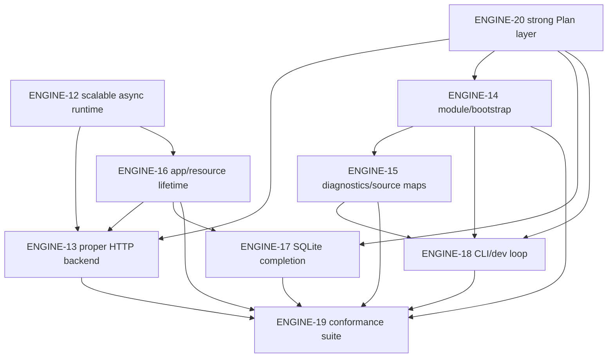

# ENGINE-13+ Issue Index

Status: created GitHub issue index for the remaining Slop Engine foundation EPICs.

This index records the live GitHub issues created from
`docs/project/engine-13-plus-architecture.md`. It is a planning and navigation document,
not an implementation claim.

## EPICs And Tasks

### ENGINE-13: Proper HTTP Runtime Backend

EPIC: [#311](https://github.com/RtlZeroMemory/Slop/issues/311)

Tasks:

- [#319](https://github.com/RtlZeroMemory/Slop/issues/319): TASK ENGINE-13.A: HTTP
  Backend Architecture and Platform Boundary
- [#320](https://github.com/RtlZeroMemory/Slop/issues/320): TASK ENGINE-13.B: Connection
  and Request Lifecycle
- [#321](https://github.com/RtlZeroMemory/Slop/issues/321): TASK ENGINE-13.C: Parser
  Limits, Timeouts, and Backpressure
- [#322](https://github.com/RtlZeroMemory/Slop/issues/322): TASK ENGINE-13.D: Body Reader
  and Cancellation Integration
- [#323](https://github.com/RtlZeroMemory/Slop/issues/323): TASK ENGINE-13.E: Graceful
  Shutdown and Server Diagnostics
- [#324](https://github.com/RtlZeroMemory/Slop/issues/324): TASK ENGINE-13.F: HTTP
  Backend Stress and Conformance Smoke

### ENGINE-14: Module Loading and Runtime Bootstrap Completion

EPIC: [#312](https://github.com/RtlZeroMemory/Slop/issues/312)

Tasks:

- [#325](https://github.com/RtlZeroMemory/Slop/issues/325): TASK ENGINE-14.A: Bootstrap
  Asset Loading Contract
- [#326](https://github.com/RtlZeroMemory/Slop/issues/326): TASK ENGINE-14.B: App Module
  Loading and Cache Policy
- [#327](https://github.com/RtlZeroMemory/Slop/issues/327): TASK ENGINE-14.C: ESM vs
  Classic Runtime Decision
- [#328](https://github.com/RtlZeroMemory/Slop/issues/328): TASK ENGINE-14.D: Intrinsic
  Boundary and Import Rewrite Contract
- [#329](https://github.com/RtlZeroMemory/Slop/issues/329): TASK ENGINE-14.E: Module
  Loading Diagnostics and Tests

### ENGINE-15: Source Maps and Diagnostics Completion

EPIC: [#313](https://github.com/RtlZeroMemory/Slop/issues/313)

Tasks:

- [#330](https://github.com/RtlZeroMemory/Slop/issues/330): TASK ENGINE-15.A: Compiler
  Source Map Completion
- [#331](https://github.com/RtlZeroMemory/Slop/issues/331): TASK ENGINE-15.B: V8
  Exception Source Remapping
- [#332](https://github.com/RtlZeroMemory/Slop/issues/332): TASK ENGINE-15.C: Async
  Diagnostic JSON and Source Frames
- [#333](https://github.com/RtlZeroMemory/Slop/issues/333): TASK ENGINE-15.D: Redaction
  and Stable Diagnostic Codes
- [#334](https://github.com/RtlZeroMemory/Slop/issues/334): TASK ENGINE-15.E:
  Diagnostic Golden Suite

### ENGINE-16: App Host and Resource Lifetime Runtime

EPIC: [#314](https://github.com/RtlZeroMemory/Slop/issues/314)

Tasks:

- [#335](https://github.com/RtlZeroMemory/Slop/issues/335): TASK ENGINE-16.A: App
  Startup and Shutdown Lifecycle
- [#336](https://github.com/RtlZeroMemory/Slop/issues/336): TASK ENGINE-16.B: Request
  Scope and App Scope Ownership
- [#337](https://github.com/RtlZeroMemory/Slop/issues/337): TASK ENGINE-16.C: Resource
  Cleanup on Success/Error/Cancel
- [#338](https://github.com/RtlZeroMemory/Slop/issues/338): TASK ENGINE-16.D:
  Leak-Oriented Test Hooks
- [#339](https://github.com/RtlZeroMemory/Slop/issues/339): TASK ENGINE-16.E: Lifecycle
  Diagnostics

### ENGINE-17: SQLite Runtime and Data Access Completion

EPIC: [#315](https://github.com/RtlZeroMemory/Slop/issues/315)

Tasks:

- [#340](https://github.com/RtlZeroMemory/Slop/issues/340): TASK ENGINE-17.A: SQLite
  Public JS API Finalization
- [#341](https://github.com/RtlZeroMemory/Slop/issues/341): TASK ENGINE-17.B: SQLite
  Capability-Wired Open/Use
- [#342](https://github.com/RtlZeroMemory/Slop/issues/342): TASK ENGINE-17.C: SQLite
  Transactions and Prepared Statement Decision
- [#343](https://github.com/RtlZeroMemory/Slop/issues/343): TASK ENGINE-17.D: SQLite
  Result Mapping and Error Policy
- [#344](https://github.com/RtlZeroMemory/Slop/issues/344): TASK ENGINE-17.E: SQLite
  Users API Runtime Proof

### ENGINE-18: CLI and Dev Loop Runtime

EPIC: [#316](https://github.com/RtlZeroMemory/Slop/issues/316)

Tasks:

- [#345](https://github.com/RtlZeroMemory/Slop/issues/345): TASK ENGINE-18.A: sloppyc
  Build UX and Artifact Inspection
- [#346](https://github.com/RtlZeroMemory/Slop/issues/346): TASK ENGINE-18.B: sloppy Run
  UX and Source-Input Run Decision
- [#347](https://github.com/RtlZeroMemory/Slop/issues/347): TASK ENGINE-18.C: Doctor
  and Audit Real Artifact Checks
- [#348](https://github.com/RtlZeroMemory/Slop/issues/348): TASK ENGINE-18.D: OpenAPI
  Route Skeleton Policy
- [#349](https://github.com/RtlZeroMemory/Slop/issues/349): TASK ENGINE-18.E: Dev Loop /
  Watch Decision

### ENGINE-19: Conformance Harness and Runtime Compatibility Suite

EPIC: [#317](https://github.com/RtlZeroMemory/Slop/issues/317)

Tasks:

- [#350](https://github.com/RtlZeroMemory/Slop/issues/350): TASK ENGINE-19.A:
  Foundation Conformance Matrix
- [#351](https://github.com/RtlZeroMemory/Slop/issues/351): TASK ENGINE-19.B: V8-Gated
  Runtime Conformance
- [#352](https://github.com/RtlZeroMemory/Slop/issues/352): TASK ENGINE-19.C: HTTP and
  Async Conformance
- [#353](https://github.com/RtlZeroMemory/Slop/issues/353): TASK ENGINE-19.D: SQLite and
  Capability Conformance
- [#354](https://github.com/RtlZeroMemory/Slop/issues/354): TASK ENGINE-19.E: Package
  Outside-Checkout Smoke

### ENGINE-20: Strong Plan Strategic Layer

EPIC: [#318](https://github.com/RtlZeroMemory/Slop/issues/318)

Tasks:

- [#355](https://github.com/RtlZeroMemory/Slop/issues/355): TASK ENGINE-20.A: Typed Plan
  Graph Model
- [#356](https://github.com/RtlZeroMemory/Slop/issues/356): TASK ENGINE-20.B: Static
  Validation and Compatibility Strategy
- [#357](https://github.com/RtlZeroMemory/Slop/issues/357): TASK ENGINE-20.C:
  Plan-Driven Audit and Doctor Strategy
- [#358](https://github.com/RtlZeroMemory/Slop/issues/358): TASK ENGINE-20.D:
  Plan-Driven OpenAPI/Optimization Future Hooks
- [#359](https://github.com/RtlZeroMemory/Slop/issues/359): TASK ENGINE-20.E: Plan
  Versioning and Evolution Policy

## Recommended Order

1. ENGINE-20 first enough to establish typed Plan graph vocabulary for routes, handlers,
   providers, capabilities, artifacts, and compatibility.
2. ENGINE-14 and ENGINE-15 in parallel where module loading, source names, and diagnostics
   intersect.
3. ENGINE-16 before broad resource-owning HTTP and SQLite work, so app/request scope
   cleanup and shutdown invariants are explicit.
4. ENGINE-13 after the relevant ENGINE-12 and ENGINE-16 primitives are usable for backend
   cancellation, backpressure, and graceful shutdown.
5. ENGINE-17 once capability policy and resource ownership can be enforced through the
   SQLite bridge.
6. ENGINE-18 after the artifact, Plan, diagnostics, and runtime evidence surfaces are
   stable enough for good command UX.
7. ENGINE-19 after implementation layers exist, so conformance protects real behavior
   rather than aspirational fixtures.

## Parallelization Recommendations

- ENGINE-14.A, ENGINE-14.E, ENGINE-15.E, ENGINE-18.C, ENGINE-19.A, and ENGINE-20.A can be
  prepared as docs/golden/test-shape work before every runtime behavior exists.
- ENGINE-13.D, ENGINE-13.E, ENGINE-16.C, ENGINE-17.B, ENGINE-17.E, ENGINE-19.C, and
  ENGINE-19.D should wait for the related lifecycle, async, and capability primitives.
- ENGINE-18.E should stay a decision task until source-input run, artifact cleanup, and
  stale-build policy are settled.
- Package smoke in ENGINE-19.E should stay separate if archive or platform churn would
  obscure runtime conformance review.

## Dependency Graph

## Reporting Rules

- Default gates remain non-V8 evidence unless a V8-enabled build/test lane actually runs.
- Package smoke remains local package-layout evidence, not public release readiness.
- Live PostgreSQL and SQL Server remain optional/later evidence, not foundation blockers.
- Benchmark output remains non-claim evidence until a scoped methodology PR says
  otherwise.
- Public alpha docs stay blocked until the engine foundation evidence gate passes or is
  explicitly scoped down with honest exclusions.
